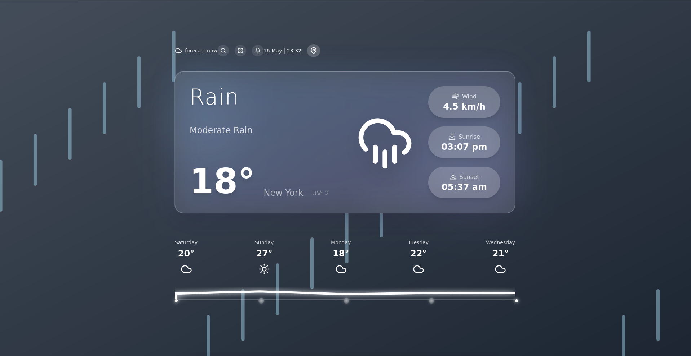

# Weather Dashboard

A modern, responsive weather application built with Next.js, React, and TypeScript. The app provides real-time weather information with a beautiful, glassmorphic UI design.

## Preview


## Features

- 🌍 **Automatic Location Detection**
  - IP-based location detection (primary)
  - GPS-based location (secondary)
  - Browser-based location (fallback)
  - Manual city search with autocomplete

- 🌤️ **Weather Information**
  - Current weather conditions
  - Temperature, humidity, and wind speed
  - Sunrise and sunset times
  - Weather forecasts
  - Dynamic weather backgrounds

- 🎨 **Modern UI**
  - Glassmorphic design
  - Responsive layout
  - Smooth animations
  - Dark mode compatible

## Tech Stack

- **Frontend Framework**: Next.js with React
- **Language**: TypeScript
- **Styling**: Tailwind CSS
- **State Management**: React Context
- **Icons**: Lucide React
- **Animations**: Framer Motion
- **Weather Data**: OpenWeather API
- **Location Services**: Mozilla Location Service, HTML5 Geolocation

## Getting Started

### Prerequisites

- Node.js (v14 or later)
- npm or yarn
- OpenWeather API key

### Installation

1. Clone the repository:
   ```bash
   git clone https://github.com/yourusername/weather-app.git
   cd weather-app
   ```

2. Install dependencies:
   ```bash
   npm install
   # or
   yarn install
   ```

3. Create a `.env` file in the root directory and add your API keys:
   ```
   NEXT_PUBLIC_OPENWEATHER_API_KEY=your_openweather_api_key
   NEXT_PUBLIC_RAPIDAPI_KEY=your_rapidapi_key
   ```

4. Run the development server:
   ```bash
   npm run dev
   # or
   yarn dev
   ```

5. Open [http://localhost:3000](http://localhost:3000) in your browser.

## Usage

1. **Automatic Location**
   - The app will automatically detect your location when you first open it
   - Uses a three-tier approach for location detection
   - Click the location button to retry if automatic detection fails

2. **Manual Search**
   - Click the search icon to enter a city name
   - Use the autocomplete suggestions to select a city
   - Press Enter or click a suggestion to view weather

3. **Weather Information**
   - View current weather conditions
   - Check temperature, wind speed, and other metrics
   - See sunrise and sunset times
   - View weather forecasts

## Project Structure

```
weather-app/
├── components/           # React components
├── contexts/            # React contexts
├── hooks/              # Custom React hooks
├── public/             # Static assets
├── styles/             # Global styles
└── types/              # TypeScript type definitions
```

## Contributing

1. Fork the repository
2. Create your feature branch (`git checkout -b feature/amazing-feature`)
3. Commit your changes (`git commit -m 'Add some amazing feature'`)
4. Push to the branch (`git push origin feature/amazing-feature`)
5. Open a Pull Request

## License

This project is licensed under the MIT License - see the [LICENSE](LICENSE) file for details.

## Acknowledgments

- [OpenWeather](https://openweathermap.org/) for weather data
- [Mozilla Location Service](https://location.services.mozilla.com/) for location services
- [Nominatim](https://nominatim.org/) for reverse geocoding
- [Rest Countries](https://restcountries.com/) for country data 
